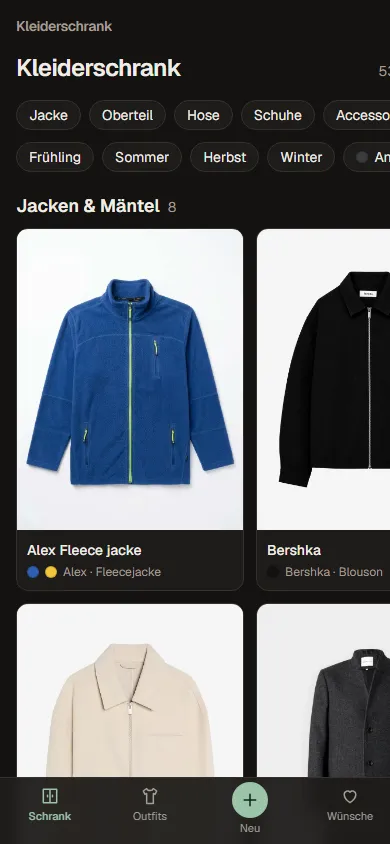
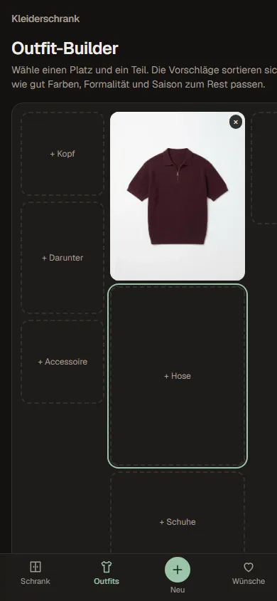

# Fashion Tracker

Mein Kleiderschrank als Git-Repo. Kleidungsstücke, Outfits, Wunschliste und Stilprofil liegen als Markdown-Dateien mit Fotos
im Repo; es gibt keine Datenbank. Eine Website (Next.js) zum Erfassen und Ansehen läuft dauerhaft auf dem Home-PC, und
**Claude Code ist der Stilberater**: Er liest dieselben Dateien, sieht sich die Fotos an und gibt Outfit- und Kaufempfehlungen.


## Funktionen

| | |
|---|---|
| **Kleiderschrank** nach Kategorien gruppiert, filterbar nach Kategorie, Saison und Farbe. Fotos werden nie abgeschnitten. | **Outfit-Builder**: Outfit als Flatlay zusammenstellen; die Vorschläge sortieren sich live nach Farbharmonie, Formalität und Saison. |
|  |  |
| **Detailseite** mit Farben, Größe, Kauf und den Outfits, in denen das Teil vorkommt. | **Outfits** als Collage, mit Anlass und Bewertung. |
|  |  |
| **Wunschliste** mit Bildern, Priorität und Begründung. „Gekauft“ macht daraus ein Kleidungsstück samt Fotos. | **Profil** mit Farbpalette, Körpermaßen (interaktive Grafik) und Größen als Grundlage für Empfehlungen. |
|  |  |
| **Statistik**: Wert, Kategorien, Farben, Ausgaben, Teile ohne Outfit. | **Empfehlungen**: Fragen an Claude stellen und seine Antworten nachlesen. |
|  |  |

Fürs Handy gebaut: Erfassen mit der Kamera, Navigation unten, der Builder passt sich an.

<p>
  
  
</p>

Alle Seiten im Detail: [docs/website.md](docs/website.md)

## So hängt alles zusammen

```
 Handy / PC (Browser)                Home-PC (NixOS)                       GitHub (privat)        Laptop mit Claude Code
 ───────────────────      ─────────────────────────────────────      ─────────────────      ──────────────────────
 Website benutzen  ──────▶ Next.js liest/schreibt Markdown + Fotos  ──▶  git push  ──────▶  git pull, /outfit,
                           committet jede Änderung automatisch      ◀──  git pull  ◀──────  /kaufempfehlung, ...
                           holt neue Commits (höchstens alle 15 min)                        committet Antworten
```

- **Daten** (`wardrobe/`, `outfits/`, `wishlist/`, `recommendations/`, `profile.md`) ändert man über die Website oder über Claude.
  Beide Wege landen als Commit im selben Repo.
- **Code** (`web/`, `scripts/`) kommt ebenfalls über Git auf den Home-PC; der Server baut sich dann selbst neu.
  Details und Fehlerbehebung: [docs/home-pc.md](docs/home-pc.md)

## Mit Claude arbeiten

Repo in Claude Code öffnen. Claude liest vor jeder Empfehlung `profile.md` und holt mit `git pull` die neuesten Teile.

| Befehl | Was passiert |
|---|---|
| `/neues-teil` | Fotos aus `inbox/` ansehen, Kleidungsstücke anlegen und die Felder vorausfüllen |
| `/outfit büro` | 2–3 Outfit-Vorschläge aus dem Schrank, auf Wunsch gespeichert |
| `/kaufempfehlung brauner Lederschuh` | Lückenanalyse und echte, aktuell verfügbare Produkte für die Wunschliste |
| `/analyse` | Statistiken, Stil-Feedback, Aussortier-Kandidaten |
| `/empfehlungen` | Fragen beantworten, die auf der Website unter „Empfehlungen“ gestellt wurden |

Die Regeln, nach denen Claude empfiehlt und Daten anlegt, stehen in [CLAUDE.md](CLAUDE.md).

## Lokal starten

```bash
npm install
npm run dev:lan
```

- Am PC: http://localhost:3000
- Am Handy (gleiches WLAN): `http://<PC-IP>:3000`. Die IP zeigt der Server beim Start unter „Network“ an.
  Beim ersten Mal fragt Windows ggf. nach einer Firewall-Freigabe für Node.js. Diese nur für **private Netzwerke** erlauben.

Lokal ist der Git-Abgleich aus; Änderungen über die Website muss man dann selbst committen.

## Hilfsskripte

| Befehl | Zweck |
|---|---|
| `npm run validate` | alle Dateien gegen das Schema prüfen (nach jeder Datenänderung) |
| `npm run stats` | Kennzahlen im Terminal, `npm run stats -- --json` für Skripte und Claude |
| `npm run photo -- <foto> <item-id>` | Foto auf 1024 px verkleinern, als WebP ohne EXIF (GPS!) ablegen |

## Dokumentation

| Datei | Inhalt |
|---|---|
| [docs/website.md](docs/website.md) | alle Seiten und Funktionen der Website, Shop-Import per Lesezeichen |
| [docs/outfit-builder.md](docs/outfit-builder.md) | wie der Builder Farben und Outfits bewertet |
| [docs/schema.md](docs/schema.md) | Datenformat: alle Felder, erlaubte Werte, Farbnamen |
| [docs/home-pc.md](docs/home-pc.md) | Server auf dem Home-PC: Dienst, Auto-Update, Fehlerbehebung |
| [CLAUDE.md](CLAUDE.md) | Anleitung für Claude: Struktur, Befehle, Regeln für Empfehlungen |

## Projektstruktur

```
profile.md                 Stil, Farbpalette, Maße, Größen
wardrobe/<id>/item.md      ein Ordner pro Kleidungsstück, dazu photo-N.webp
outfits/<id>.md            gespeicherte Kombinationen (verweisen auf Item-IDs)
wishlist/<id>.md           Kaufwünsche, Bilder in wishlist/<id>/
recommendations/<id>.md    Fragen und Antworten von Claude
inbox/                     Rohfotos für /neues-teil (nicht im Repo)
scripts/lib/               Schema, Lesen/Schreiben, Fotos, Farben, Outfit-Bewertung, Git-Abgleich
web/                       Next.js-16-App (npm-Workspace)
.claude/commands/          Slash-Commands für Claude
```

> Das Repo enthält Fotos, Körpermaße, Größen und Ausgaben. Es bleibt ein **privates** Repository.
