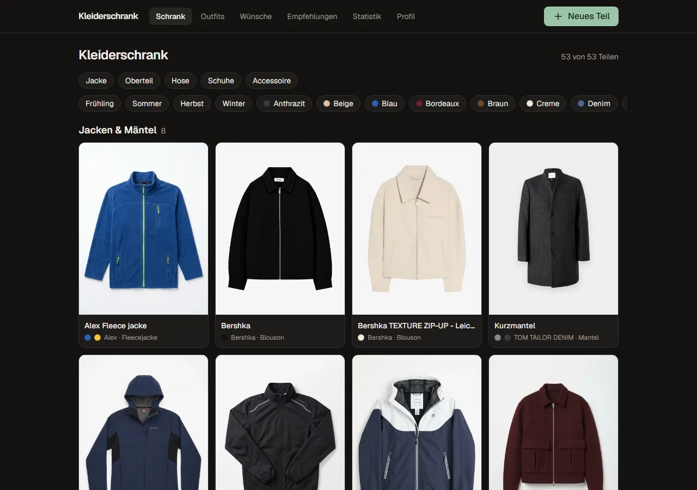
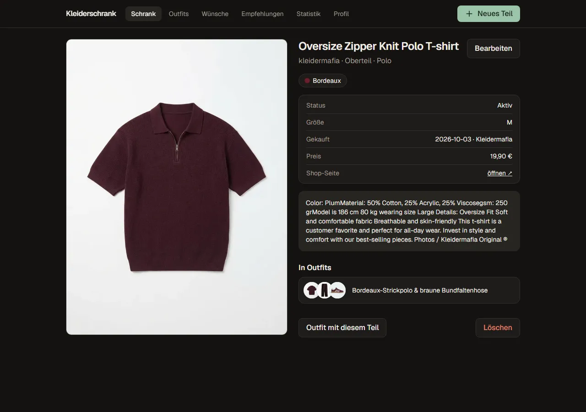
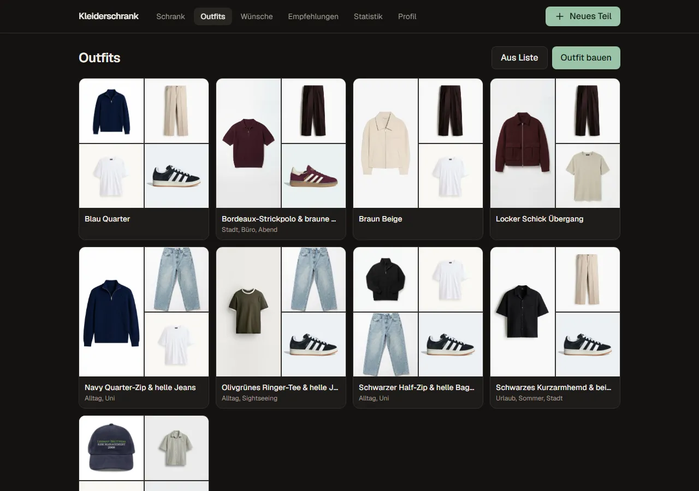
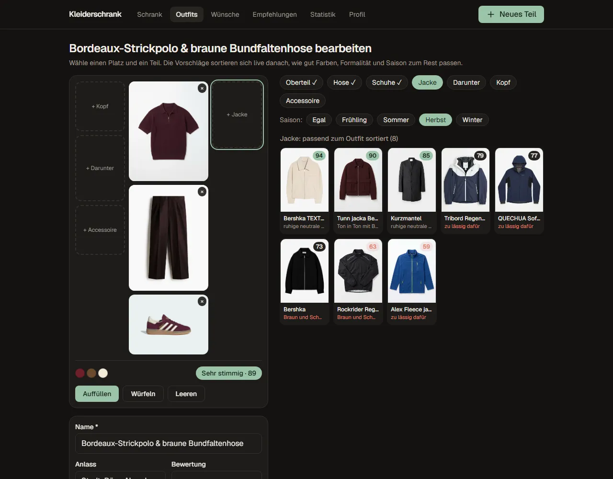
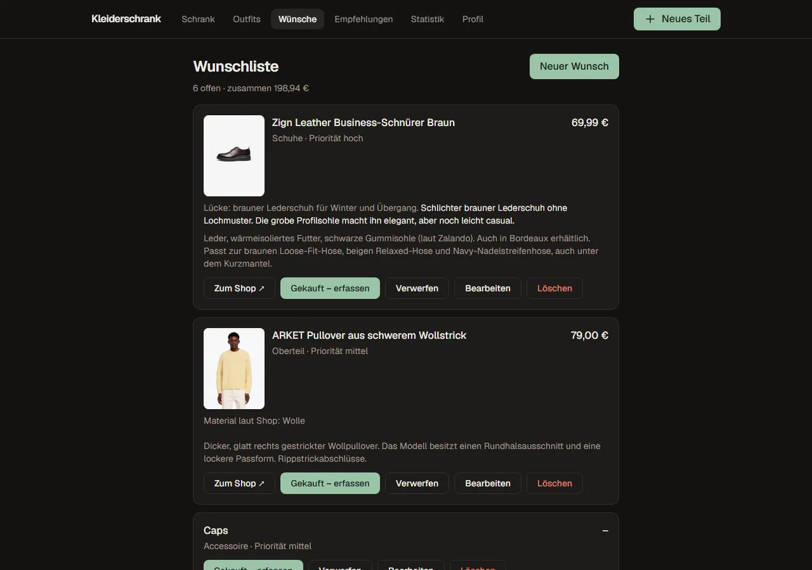
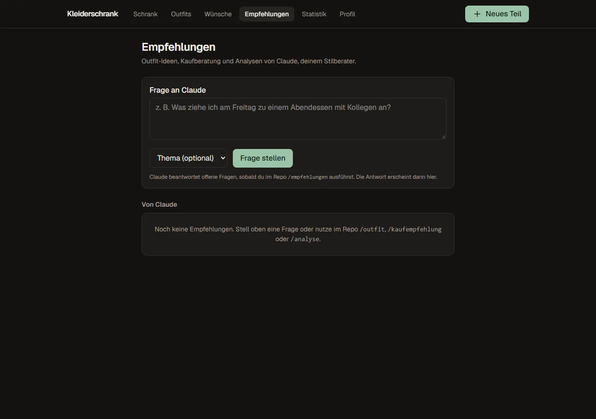
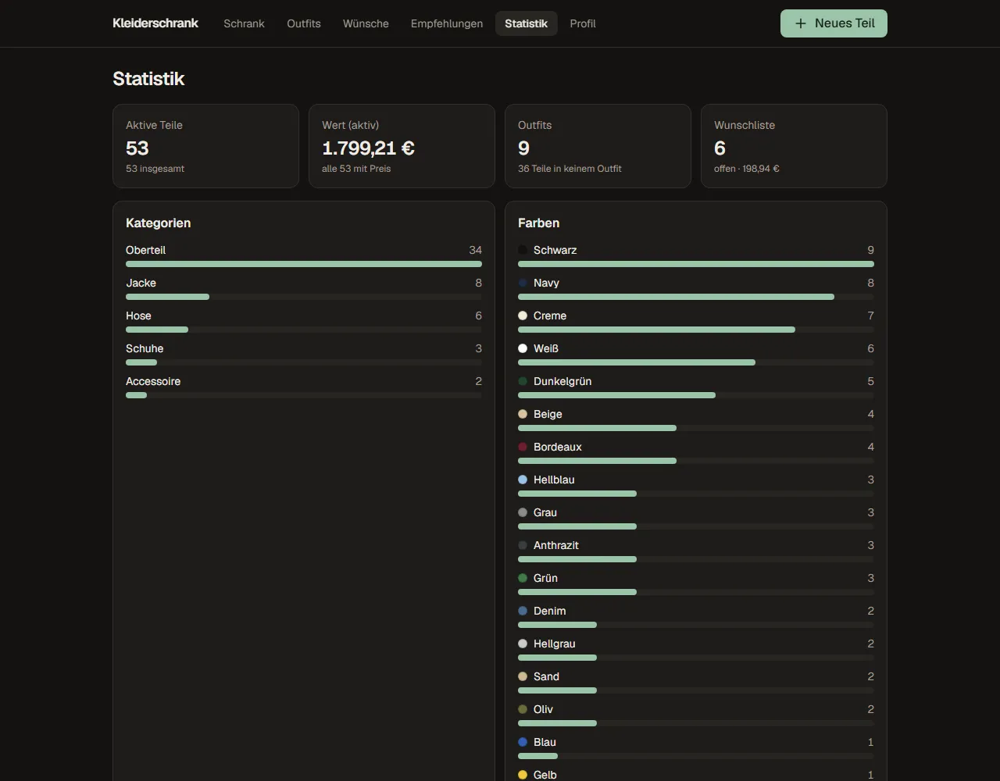
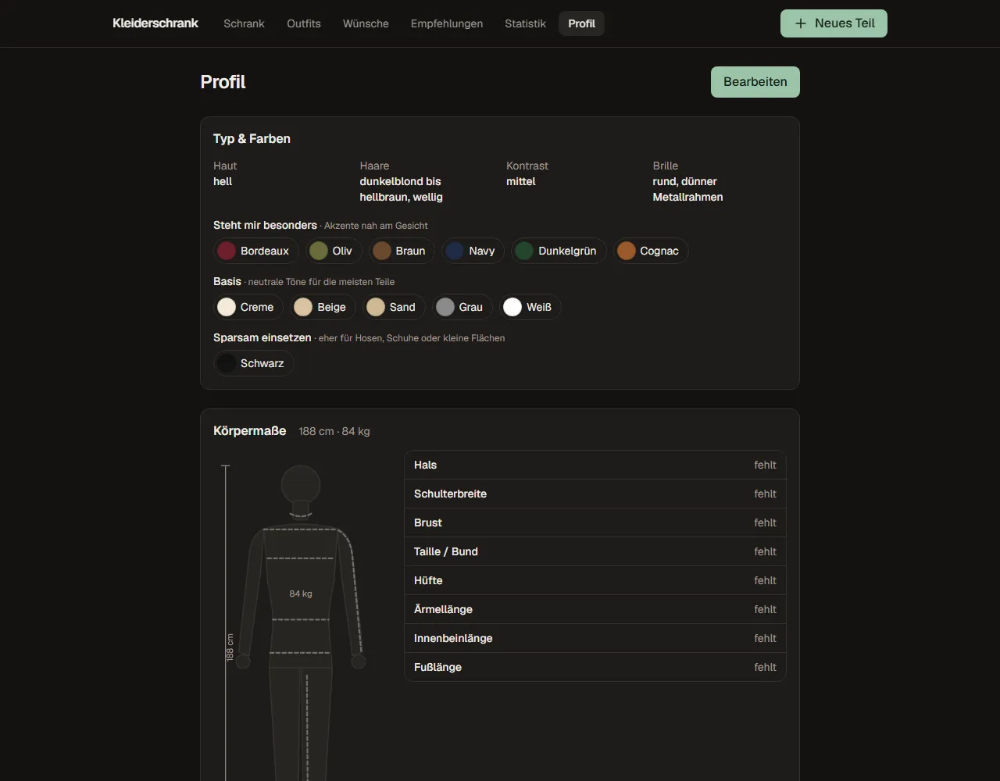

# Die Website

Next.js-16-App in `web/`. Sie liest und schreibt direkt die Dateien im Repo (über `scripts/lib/`) und hat keine eigene Datenbank.
Auf dem Home-PC läuft sie dauerhaft unter http://192.168.178.151:3000 und committet jede Änderung automatisch
(siehe [home-pc.md](home-pc.md)).

Navigation: am Handy unten **Schrank, Outfits, Neu, Wünsche, Tipps**, oben rechts Statistik und Profil.
Am PC alles in der oberen Leiste.

## Kleiderschrank (`/`)

- Teile sind nach Kategorie gruppiert: Jacken & Mäntel, Oberteile, Hosen, Schuhe, Accessoires …
- Filter oben: Kategorie, Saison und Farbe, frei kombinierbar. Die Gruppierung bleibt beim Filtern erhalten.
- Unter jedem Teil: Farbpunkte, Marke und Unterkategorie.
- Fotos werden nie abgeschnitten. Schmale Hochkant-Fotos (z. B. Hosen) bekommen einen unscharf gestreckten Hintergrund aus ihren
  eigenen Rändern, damit sie ins Raster passen.

## Teil ansehen, erfassen und bearbeiten (`/items/…`)

Die **Detailseite** zeigt alle Fotos, Farben, Status, Größe, Kauf (Datum, Preis, Shop-Link), den Beschreibungstext und die Outfits, in denen
das Teil vorkommt. „Outfit mit diesem Teil“ öffnet den Outfit-Builder mit diesem Teil.

**Neues Teil** (`/items/new`, am Handy der runde Knopf in der Mitte):

- Fotos per **Kamera**, aus der **Galerie**, per **Drag & Drop** (auch Bilder direkt aus einem Shop-Tab) oder mit **Strg+V**.
  Der Browser verkleinert sie vor dem Hochladen, der Server speichert sie als WebP mit max. 1024 px und **ohne EXIF-Daten**
  (die den GPS-Standort enthalten können).
- **Hintergrund weiß**: Unter jedem neuen Foto stellt der Knopf das Teil per KI frei und legt es auf Weiß, bei mehreren
  Fotos auch alle auf einmal („Alle Hintergründe weiß“). „Original“ macht es rückgängig. Das läuft komplett im Browser
  (Modell [RMBG-1.4](https://huggingface.co/briaai/RMBG-1.4) über onnxruntime-web, ohne API-Kosten) und dauert je nach Gerät
  10–60 Sekunden. Das Modell (88 MB) lädt der Server beim ersten Gebrauch einmalig nach `.cache/` und liefert es unter
  `/bg-model` aus; der Browser speichert es danach in IndexedDB. Lizenz von RMBG-1.4: nur nicht-kommerzielle Nutzung.
- **Kategorie** und **Unterkategorie** als Auswahl; die Unterkategorien hängen von der Kategorie ab (Liste in
  `scripts/lib/schema.mjs`).
- **Farben** aus einer festen Palette, die erste ist die Hauptfarbe.
- Muster, Material, Marke, Größe, Schnitt, Saisons, Formalität (1 Sport bis 5 formell), Status, Kaufdaten.
- **Vorschläge beim Tippen**: Aus dem Namen erkennt das Formular Kategorie, Unterkategorie, Farben, Muster, Material und
  Schnitt („Dunkelgrünes Leinenhemd kurzarm Relaxed Fit“ → Oberteil · Hemd, Dunkelgrün, Leinen, relaxed). Daraus leitet es
  **Formalität**, **Saisons** und Muster ab (Hemd 4, mit „Leinen“ 3; Leinen → Frühling/Sommer; ohne Muster-Hinweis uni),
  damit der Outfit-Builder für jedes Teil alles hat. Vorgeschlagene Felder tragen das Etikett „Vorschlag“.
  Was man selbst ändert, bleibt; beim Bearbeiten werden nur leere Felder vorgeschlagen. Die Regeln stehen in
  `scripts/lib/item-guess.mjs`.

### Aus einem Online-Shop übernehmen

Unter **Neues Teil → „Aus Online-Shop übernehmen“** (`/bookmarklet`) das Lesezeichen „Zum Kleiderschrank“ einmalig in die
Firefox-Symbolleiste ziehen. Auf einer Produktseite angeklickt, übernimmt es Name, Marke, Preis, Farbe, Material, Kategorie
und Produktbilder; Formalität, Saisons und Muster werden wie oben vorgeschlagen (Farbe notfalls aus dem Namen, z. B.
„… - Beige“). Auf der Zwischenseite (`/import`) wählt man, ob daraus ein **Kleidungsstück** oder ein **Wunsch** wird.
Läuft komplett lokal, ohne KI. Getestet mit Zara, H&M und About You; Zalando blockiert das Auslesen teilweise.

## Outfits (`/outfits`)

- Übersicht als Collage mit Anlass, Bewertung und Hinweis, ob Claude das Outfit vorgeschlagen hat.
- Oben rechts auf jeder Karte die Punktzahl des Outfit-Builders (0–100, gleiche Farben wie im Builder); beim Darüberfahren
  Urteil und erkannte Probleme.
- **Outfit bauen** öffnet den Builder (siehe unten), **Aus Liste** die schlichte Auswahl per Raster.
- Auf der Outfit-Seite: **Im Builder** (visuell bearbeiten) oder **Bearbeiten** (Formular).

### Outfit-Builder (`/outfits/builder`)

- Das Outfit liegt als Flatlay da: Oberteil, Hose und Schuhe in der Mitte, Jacke rechts, Kopf, „Darunter“ und Accessoire links.
- Platz antippen, Teil wählen. Danach springt der Builder zum nächsten leeren Pflichtplatz.
- „Darunter“ bietet nur Shirts und Hemden an, die unter das gewählte Oberteil passen. Landet ein Hemd unter einem T-Shirt,
  tauschen die beiden die Plätze.
- Die Vorschläge für den gewählten Platz sind **live nach Passung sortiert** (0–100) und begründet, z. B. „Ton in Ton mit
  Bordeaux“, „neutral, erdet Bordeaux“, „zu lässig dafür“, „zu viele Farben“, „Fleecejacke über Hoodie“.
- Unter dem Outfit: Farbpunkte, Gesamturteil (*Sehr stimmig*, *Stimmig*, *Mutig*, *Unruhig*) und erkannte Probleme.
- **Auffüllen** ergänzt leere Plätze so, dass das ganze Outfit am stimmigsten ist (ab Herbst auch eine Jacke), **Würfeln**
  wählt zufällig eines der stimmigsten, **Leeren** fängt neu an.
- **Saison**-Filter: Teile, die nicht zur gewählten Saison passen, rutschen nach unten. Vorausgewählt ist die aktuelle Jahreszeit.
- Ab zwei Teilen erscheint das Speicherformular. Name (aus den Farben vorgeschlagen) und gemeinsame Saisons sind vorausgefüllt.
- Aufruf mit Startteilen: `/outfits/builder?items=<id>,<id>`, ein gespeichertes Outfit bearbeiten: `?outfit=<id>`.

Wie die Bewertung rechnet: [outfit-builder.md](outfit-builder.md)

## Wunschliste (`/wishlist`)

- Wünsche mit Bild, Priorität, Preis, Shop-Link, welche Lücke sie schließen und warum.
- Bilder per Upload, Drag & Drop oder automatisch beim Shop-Import.
- **Gekauft – erfassen** öffnet das Formular für ein neues Teil, vorausgefüllt mit den Daten des Wunsches; die Bilder lassen
  sich übernehmen. Danach steht der Wunsch auf „gekauft“.
- **Verwerfen** und **Wieder öffnen**; erledigte Wünsche stehen eingeklappt unten.

## Empfehlungen (`/empfehlungen`)

- Eine **Frage an Claude** stellen, optional mit Thema (Outfit, Kaufberatung, Analyse, Stil).
- Claude beantwortet offene Fragen im Repo mit `/empfehlungen`; die Antwort erscheint nach dem nächsten Abgleich hier, mit
  verlinkten Teilen, Outfits und Wünschen.
- `/outfit`, `/kaufempfehlung` und `/analyse` bieten an, ihre Ergebnisse ebenfalls hier abzulegen.
- Erledigtes lässt sich archivieren oder löschen.

## Statistik (`/stats`)

Aktive Teile, Wert des Schranks, Outfits, offene Wünsche; Verteilung nach Kategorie und Farbe, Ausgaben pro Jahr und die Teile,
die **in keinem Outfit** vorkommen (Kandidaten für neue Kombinationen oder fürs Aussortieren). Dieselben Zahlen liefert
`npm run stats` im Terminal.

## Profil (`/profile`)

- **Typ & Farben**: Haut, Haare, Kontrast, Brille und die Farbpalette in drei Stufen: *Steht mir besonders*, *Basis*,
  *Sparsam einsetzen*. Der Outfit-Builder bevorzugt Farben aus der ersten Stufe.
- **Körpermaße** mit interaktiver Grafik: Hover oder Tippen auf ein Maß zeigt, wo gemessen wird; durchgezogene Linie = erfasst,
  gestrichelt = fehlt. Die Messanleitung steht im Formular.
- **Größen** pro Kleidungsart und Abweichungen je Marke.
- Darunter der freie Text aus `profile.md` mit Stil, Budget, Anlässen und Claudes Notizen.

Alles ist unter **Bearbeiten** änderbar und landet im Frontmatter von `profile.md`.

## Technisches

- Server Actions in `web/app/actions.ts` schreiben über `scripts/lib/data.mjs`; nach jeder Änderung folgt `commitAndPush`
  (nur mit `GIT_AUTOSYNC=1`).
- Fotos liegen außerhalb von `public/` und werden über `/photos/<id>/<datei>` bzw. `/wish-photos/<id>/<datei>` ausgeliefert.
- `DATA_DIR` zeigt die Website auf einen anderen Datenordner, z. B. für Tests mit Kopien der Daten.
- Next.js 16 weicht in einigen APIs von älteren Versionen ab; vor Änderungen `web/AGENTS.md` lesen.
